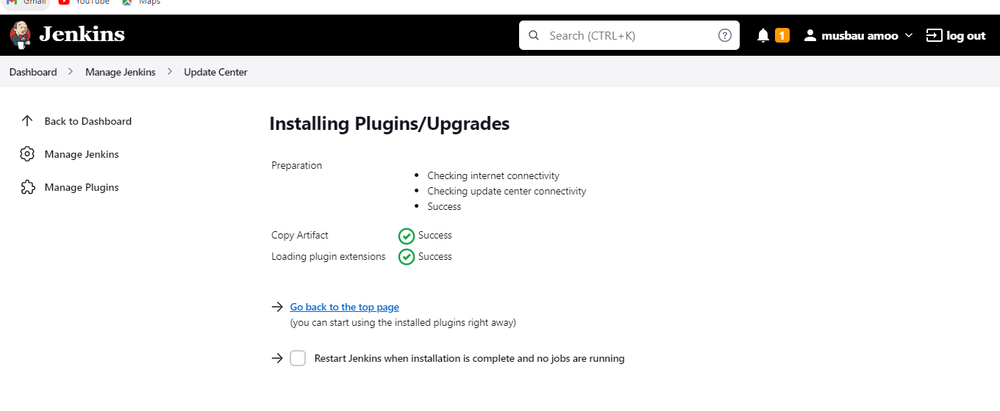
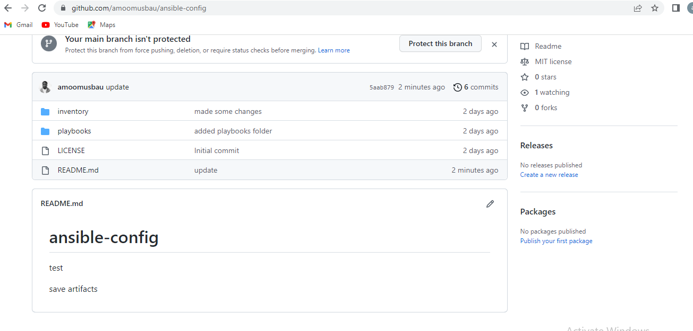
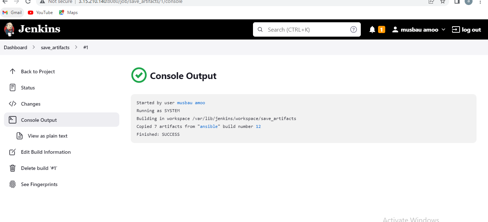

**ANSIBLE REFACTORING AND STATIC ASSIGNMENTS (IMPORTS AND ROLES)**

**Go to Jenkins web console -> Manage Jenkins -> Manage Plugins -> on Available tab search for Copy Artifact and install this plugin without restarting Jenkins**

****

**Test your set up by making some change in README.MD file inside your ansible-config-mgt repository (right inside master branch).**

****

****

